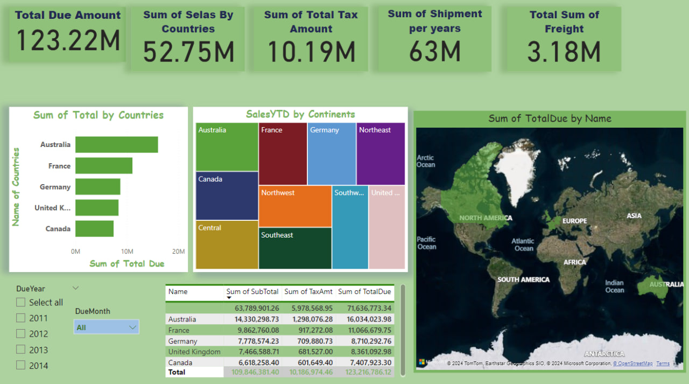
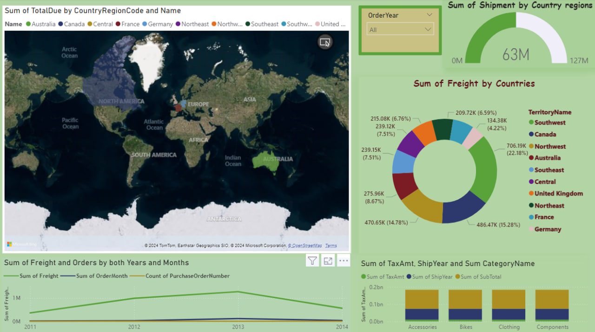
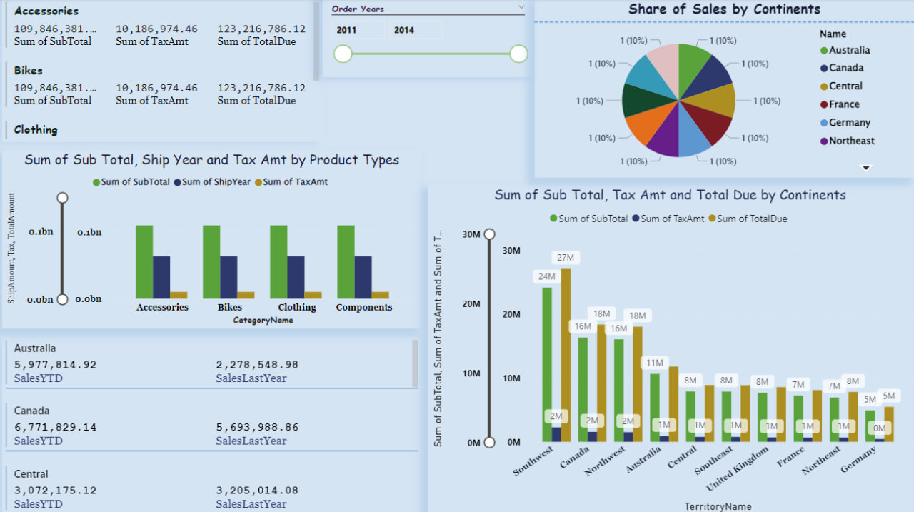

# Power BI Sales Analysis Dashboard

This repository contains the Power BI project created using the AdventureWorks database. The project aims to create a comprehensive sales analysis dashboard that provides insights into the sales performance, product distribution, and profitability within the AdventureWorks dataset.


## Project aim

The primary objective of this project is to:

- Analyze sales and product data from AdventureWorks.
- Visualize key metrics such as TotalDue, Order Quantity, and Profit by product and region.
- Forecast future sales trends using a linear regression model.
- Enhance data analysis and Power BI visualization skills.


## Features
- Sales Performance Dashboard: Key metrics like Sales Amount, Units Sold, and Profit by Product and Country.
- Product Insights: Sales by Product Subcategory and Product Profitability.
- Sales Forecasting: Using a linear regression model to predict TotalDue values for future periods.
- Data Filtering: Interactive filters by year, country, and product category.


## Used technologies

The following technologies and libraries were used in this project:
- Power BI: For building the dashboard and creating data visualizations.
- SQL Server: For connecting to the AdventureWorks database and writing SQL queries to fetch and clean data.
- Python: Used for building a regression model to forecast future sales.
- AdventureWorks 2022 Database: The data source for the sales analysis.
- Python py file
- os

   1st Page


   2nd Page


   3rd Page


## How to use

1. Clone the repository:
   ```bash
   git clone https://github.com/CoderGoC/Exam.git
   ```
2. Create a virtual environment and install the required libraries:
   ```bash
   cd Data-science-home-work
   python -m venv venv
   ```
   ```bash
   source venv/bin/activate  # Linux/Mac
   ```
   ```bash
   .\venv\Scripts\activate  # Windows
   ```
   ```bash
   pip install -r requirements.txt
   ```
3. Run the Python py file:
   ```bash
   Streamlit run Home.py
   ```


## Results
The dashboard provides a detailed analysis of the sales data, allowing users to:

- Track sales performance by region and product.
- Analyze product profitability and sales trends.
- Forecast future sales using historical data.

## Contribute

If you would like to contribute to the project, please follow these steps:
1. Fork the repository
2. Open a new branch (`git checkout -b feature/YourFeature`)
3. Commit the changes (`git commit -m 'Add some feature'')
4. Push the branch (`git push origin feature/YourFeature`)
5. Create a pull request

## Litsenziya

This project is distributed under the MIT license. See the [LICENSE](LICENSE) file for details.


Thank you for your interest in the project!!!
